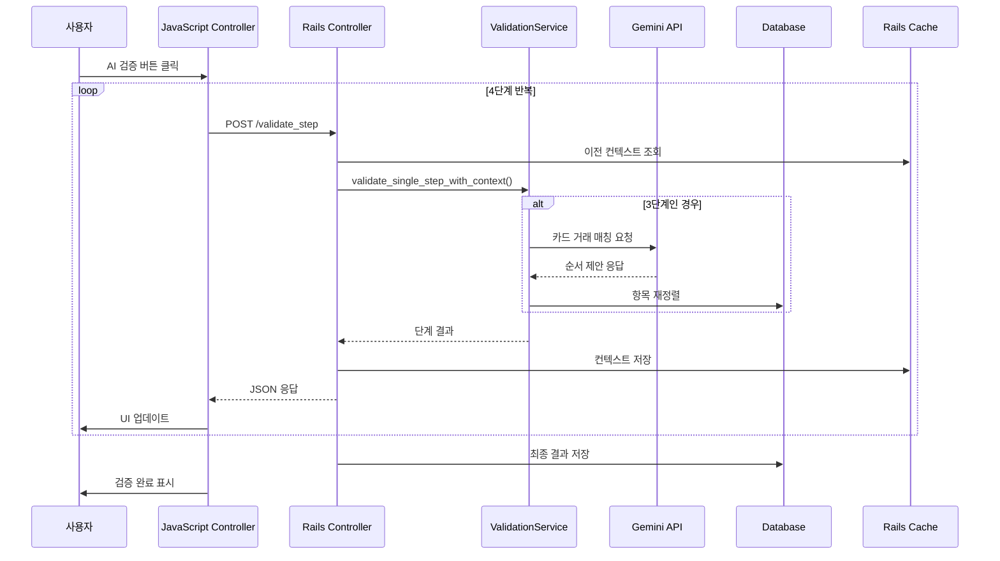

# AI 검증 시스템 가이드

## 목차
1. [시스템 개요](#시스템-개요)
2. [사용자 가이드](#사용자-가이드)
3. [시스템 아키텍처](#시스템-아키텍처)
4. [내부 프로세스 플로우](#내부-프로세스-플로우)
5. [기술적 상세](#기술적-상세)
6. [데이터베이스 구조](#데이터베이스-구조)
7. [에러 처리 및 복구](#에러-처리-및-복구)
8. [성능 및 최적화](#성능-및-최적화)

## 시스템 개요

### 목적
경비 시트의 자동 검증을 통해 다음을 달성합니다:
- 법인카드 명세서와 경비 항목의 자동 매칭
- 경비 정책 준수 여부 자동 확인
- 영수증 첨부 필요 항목 자동 식별
- 경비 항목 순서 자동 정렬

### 핵심 기능
- **4단계 순차 검증**: 각 단계별 독립적 검증 수행
- **실시간 진행 표시**: 사용자에게 검증 진행 상황 실시간 피드백
- **자동 조정**: 문제 발견 시 가능한 경우 자동 수정
- **상세 결과 리포트**: 검증 결과를 시각적으로 표시

### Gemini API 통합
- Google Gemini Flash 1.5 모델 사용
- 법인카드 명세서 OCR 데이터와 경비 항목 매칭
- 토큰 사용량 추적 및 최적화

## 사용자 가이드

### 검증 시작하기

1. **경비 시트 페이지 접속**
   - 월별 경비 시트 목록에서 검증할 시트 선택
   - 경비 항목과 첨부파일이 모두 준비되어 있어야 함

2. **AI 검증 버튼 클릭**
   ```
   [AI 검증] 버튼 → 자동으로 4단계 검증 시작
   ```

3. **진행 상황 모니터링**
   - 각 단계별 진행 상황이 실시간으로 표시
   - 녹색 체크(✅): 단계 완료
   - 진행 중 스피너: 현재 처리 중
   - 빨간 X(❌): 검증 실패

### 4단계 검증 프로세스

#### 1단계: 첨부파일 검증
- **목적**: 법인카드 명세서 첨부 여부 확인
- **검증 내용**:
  - PDF 형식의 법인카드 명세서 존재 여부
  - 파일 크기 및 유효성 확인
- **결과**: 통과/실패

#### 2단계: 통신비 위치 검증
- **목적**: 통신비가 경비 항목 최상단에 위치하는지 확인
- **검증 내용**:
  - 통신비(EC002) 항목 존재 여부
  - Position 1 위치 여부
- **자동 조정**: 통신비가 다른 위치에 있으면 자동으로 최상단으로 이동

#### 3단계: 항목 순서/금액 검증
- **목적**: 법인카드 명세서 순서에 맞춰 경비 항목 정렬
- **검증 내용**:
  - Gemini API를 통한 카드 거래와 경비 항목 매칭
  - 법인카드 거래 순서대로 재정렬
  - 카드 명세서에 없는 개인 경비 식별
- **자동 조정**: 
  - 통신비는 position 1 유지
  - 나머지 항목은 카드 거래 순서대로 재정렬
  - 개인 경비 항목 플래그 설정

#### 4단계: 영수증 첨부 확인
- **목적**: 개인 경비 항목의 영수증 첨부 확인
- **검증 내용**:
  - 3단계에서 식별된 개인 경비 항목
  - 각 항목의 영수증 첨부 여부
- **결과 표시**:
  - ✅ 영수증 첨부됨
  - ❌ 영수증 미첨부 (조치 필요)

### 검증 결과 해석

#### 상태 아이콘
- 💳 **법인카드**: 카드 명세서에 있는 거래
- 📎 **개인 경비**: 카드 명세서에 없는 항목 (영수증 필요)
- ✅ **통신비**: 최상단 고정 항목

#### 검증 결과 메시지
- **모든 검증 통과**: 모든 항목이 정책을 준수함
- **검증 실패**: 특정 항목에 조치가 필요함
  - 영수증 누락 항목 수
  - 구체적인 조치 사항 안내

#### 토큰 사용량
- 3단계 Gemini API 호출 시 사용된 토큰 수
- 프롬프트 토큰 + 응답 토큰 = 총 토큰

## 시스템 아키텍처

### 주요 컴포넌트

#### 1. ExpenseValidationService (`app/services/expense_validation_service.rb`)
핵심 검증 로직을 담당하는 서비스 클래스

**주요 메서드:**
```ruby
# 단일 단계 실행
validate_single_step_with_context(sheet_attachments, expense_items, step_number, previous_context)

# 개별 단계 검증 메서드
validate_step_1_attachment()  # 첨부파일 검증
validate_step_2_telecom()      # 통신비 위치 검증
validate_step_3_combined()     # 순서/금액 통합 검증
validate_step_4_receipt_check() # 영수증 확인

# 재정렬 실행
reorder_items_by_card_statement(expense_items, suggested_order)

# 최종 결과 컴파일
compile_final_result(accumulated, expense_items)
```

**Gemini API 통합:**
```ruby
# 3단계에서만 Gemini API 호출
@gemini_service.analyze_for_expense_ordering(prompt)
```

#### 2. ExpenseSheetsController (`app/controllers/expense_sheets_controller.rb`)
검증 요청을 처리하는 컨트롤러

**주요 액션:**
```ruby
# 단계별 검증 실행
def validate_step
  step_number = params[:step].to_i
  result = validation_service.validate_single_step_with_context(...)
  
  # 컨텍스트 캐싱
  Rails.cache.write(cache_key, previous_context, expires_in: 10.minutes)
  
  # 4단계 완료 시 최종 처리
  if step_number == 4
    final_result = validation_service.compile_all_steps_result(previous_context)
    # DB 저장 및 상태 업데이트
  end
end

# 검증 결과 조회
def validation_result
  context = Rails.cache.read(context_key)
  # 각 단계별 결과 수집 및 반환
end
```

#### 3. ai_validation_controller.js (Stimulus Controller)
프론트엔드 검증 제어를 담당

**주요 기능:**
```javascript
// 4단계 순차 실행
async validateWithAI(event) {
  for (let step = 1; step <= 4; step++) {
    // 단계별 API 호출
    const response = await fetch(`/expense_sheets/${id}/validate_step`, {
      method: 'POST',
      body: JSON.stringify({ step: step })
    })
    
    // UI 업데이트
    this.updateStepStatus(step, 'processing')
    
    // 결과 로깅
    this.logStepResult(step, stepData)
  }
}

// 진행 상황 UI 업데이트
updateStepStatus(step, status) {
  // DOM 조작으로 상태 표시
}
```

#### 4. 뷰 컴포넌트

**_validation_progress.html.erb**
- 4단계 진행 상황 실시간 표시
- 각 단계별 상태 아이콘과 메시지

**_validation_details_table.html.erb**
- 검증 완료 후 상세 결과 표시
- 법인카드 거래 내역
- 재정렬 결과
- 영수증 필요 항목
- 토큰 사용량

## 내부 프로세스 플로우



## 기술적 상세

### 캐싱 전략

**캐시 키 구조:**
```ruby
cache_key = "validation_context_#{expense_sheet.id}_#{current_user.id}"
```

**캐시 데이터 구조:**
```ruby
{
  "step_1" => {
    name: "첨부파일 검증",
    status: "success",
    validation_details: [...],
    issues_found: [],
    token_usage: {...}
  },
  "step_2" => {...},
  "step_3" => {
    suggested_order: {
      reorder_needed: true,
      reorder_details: [...],
      items_needing_receipts: [...]
    }
  },
  "step_4" => {
    receipt_check: {
      items_missing_receipts: [...]
    }
  }
}
```

**TTL (Time To Live):** 10분

### Gemini API 통합 (3단계)

**프롬프트 구성:**
```ruby
prompt = {
  system_prompt: "경비 검증 전문가. JSON 형식으로만 응답하세요.",
  validation_rules: "규칙 설명...",
  expense_sheet_data: card_transactions,  # OCR 추출 데이터
  expense_items: items_list,              # 경비 항목 목록
  request: "매칭 및 재정렬 요청..."
}
```

**응답 형식:**
```json
{
  "suggested_order": {
    "reorder_needed": true,
    "reorder_details": [
      {"item_id": 624, "pos": 1},
      {"item_id": 625, "pos": 2}
    ],
    "items_needing_receipts": [
      {"item_id": 643, "description": "야근식대", "amount": 13521}
    ]
  }
}
```

**토큰 사용량:**
- 평균: 2400 토큰/검증
- 프롬프트: ~1600 토큰
- 응답: ~400 토큰

### 자동 조정 기능

**2단계 - 통신비 자동 이동:**
```ruby
def auto_adjust_telecom_position(expense_items)
  telecom = expense_items.find { |item| item.expense_code.code == 'EC002' }
  if telecom && telecom.position != 1
    # 다른 항목들의 position 조정
    expense_items.where('position < ?', telecom.position).update_all('position = position + 1')
    telecom.update!(position: 1)
  end
end
```

**3단계 - 카드 명세서 순서 재정렬:**
```ruby
def reorder_items_by_card_statement(expense_items, suggested_order)
  suggested_order['reorder_details'].each do |detail|
    item = expense_items.find { |ei| ei.id == detail['item_id'].to_i }
    item.update!(position: detail['pos']) if item
  end
end
```

## 데이터베이스 구조

### expense_items 테이블
```sql
-- 검증 관련 필드
validation_status VARCHAR     -- pending/validated/warning/failed
validation_message TEXT       -- 검증 메시지
validated_at TIMESTAMP        -- 검증 시각
position INTEGER              -- 표시 순서
```

### expense_validation_histories 테이블
```sql
CREATE TABLE expense_validation_histories (
  id BIGINT PRIMARY KEY,
  expense_sheet_id BIGINT,
  validated_by_id BIGINT,       -- 검증 실행 사용자
  validation_summary TEXT,       -- 전체 요약
  all_valid BOOLEAN,            -- 전체 통과 여부
  validation_details JSONB,     -- 항목별 상세 결과
  issues_found JSONB,           -- 발견된 문제들
  recommendations JSONB,        -- 권장 사항
  created_at TIMESTAMP
)
```

### expense_sheets 테이블
```sql
-- 검증 관련 필드
validation_result JSONB       -- 최신 검증 결과
validation_status VARCHAR     -- pending/validated/warning
validated_at TIMESTAMP
```

## 에러 처리 및 복구

### Gemini API 오류 처리

**네트워크 오류:**
```ruby
begin
  response = @gemini_service.analyze_for_expense_ordering(prompt)
rescue Net::ReadTimeout, Net::OpenTimeout => e
  Rails.logger.error "Gemini API timeout: #{e.message}"
  return fallback_validation_result(items_data)
end
```

**파싱 오류:**
```ruby
def parse_step_response(response, items_data)
  begin
    data = JSON.parse(response)
  rescue JSON::ParserError => e
    Rails.logger.error "JSON 파싱 실패: #{e.message}"
    return {
      validation_details: items_data.map { |item| 
        { 'item_id' => item[:id], 'status' => '미검증', 'message' => 'AI 응답 파싱 실패' }
      }
    }
  end
end
```

### Fallback 로직

**3단계 Gemini 실패 시:**
```ruby
# 직접 금액 매칭으로 대체
def fallback_matching(card_transactions, expense_items)
  items_needing_receipts = []
  expense_items.each do |item|
    next if item.expense_code.code == 'EC002'  # 통신비 제외
    
    # 카드 거래에서 동일 금액 찾기
    card_match = card_transactions.any? { |t| t[:amount].to_i == item.amount.to_i }
    items_needing_receipts << item unless card_match
  end
  return items_needing_receipts
end
```

### 단계별 실패 처리

**이전 단계 실패 시 건너뛰기:**
```ruby
# 1단계가 실패하면 2,3,4단계 모두 건너뜀
if previous_context["step_1"][:status] == 'failed'
  return {
    step: step_number,
    status: 'skipped',
    message: '이전 단계 검증 실패로 인해 건너뜀'
  }
end
```

## 성능 및 최적화

### 응답 시간
- **1단계**: ~100ms (DB 조회만)
- **2단계**: ~200ms (position 업데이트 포함)
- **3단계**: 3-5초 (Gemini API 호출)
- **4단계**: ~150ms (영수증 확인)
- **전체**: 5-10초

### 토큰 최적화

**프롬프트 최소화:**
- 필요한 데이터만 전송
- 중복 정보 제거
- 간결한 지시사항

**캐싱 활용:**
- 10분간 검증 컨텍스트 유지
- 재검증 시 기존 결과 재사용

### 동시성 처리
- 사용자별 독립적인 캐시 키
- 트랜잭션으로 데이터 일관성 보장

### 모니터링 지표
```ruby
Rails.logger.info "3단계 토큰 사용량: #{response['token_usage'].inspect}"
Rails.logger.info "재정렬된 항목 수: #{reorder_count}"
Rails.logger.info "영수증 필요 항목: #{items_needing_receipts.size}개"
```

## 향후 개선 사항

1. **배치 검증**: 여러 시트 동시 검증
2. **검증 규칙 커스터마이징**: 조직별 규칙 설정
3. **검증 이력 분석**: 패턴 분석 및 개선 제안
4. **API 비용 최적화**: 토큰 사용량 추가 최적화
5. **오프라인 모드**: 네트워크 없이 기본 검증

## 트러블슈팅

### 자주 발생하는 문제

**Q: 검증이 중간에 멈춤**
- A: 브라우저 콘솔에서 에러 확인
- 네트워크 탭에서 API 응답 확인
- Rails 로그에서 상세 에러 확인

**Q: 영수증이 있는데도 누락으로 표시**
- A: 영수증이 ExpenseItem에 직접 첨부되었는지 확인
- ExpenseSheetAttachment가 아닌 ExpenseAttachment 확인

**Q: 재정렬이 제대로 안 됨**
- A: 카드 명세서 OCR 데이터 확인
- Gemini 응답의 suggested_order 확인

### 디버깅 방법

**브라우저 콘솔:**
```javascript
// 각 단계별 상세 로그 확인
console.log('🔍 3단계 상세 정보:')
console.table(stepResult.debug_info.gemini_request.card_transactions)
```

**Rails 콘솔:**
```ruby
# 캐시된 컨텍스트 확인
context = Rails.cache.read("validation_context_125_1")
pp context["step_3"][:suggested_order]
```

**로그 파일:**
```bash
tail -f log/development.log | grep "검증"
```